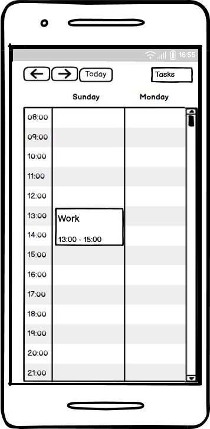

# Требования к проекту "TaskManager"
---

# Содержание
1. [Введение](#intro)  
    1.1. [Назначение](#appointment)  
    1.2. [Бизнес-требования](#business_requirements)  
        1.2.1. [Исходные данные](#initial_data)  
        1.2.2. [Возможности](#business_opportunities)  
        1.2.3. [Границы проекта](#project_boundary)  
    1.3. [Аналоги](#analogues)  
2. [Требования пользователя](#user_requirements)  
    2.1. [Программные интерфейсы](#software_interfaces)  
    2.2. [Интерфейс пользователя](#user_interface)  
    2.3. [Характеристики пользователей](#user_specifications)  
        2.3.1. [Аудитория приложения](#application_audience)  
    2.4. [Предположения и зависимости](#assumptions_and_dependencies)  
3. [Системные требования](#system_requirements)  
    3.1. [Функциональные требования](#functional_requirements)  
        3.1.1. [Основные функции](#main_functions)  
            3.1.1.1. [Управление задачами](#task_management)  
            3.1.1.2. [Календарная интеграция](#calendar_integration)  
            3.1.1.3. [Система уведомлений](#notification_system)  
            3.1.1.4. [Организация и категоризация](#organization_categorization)  
        3.1.2. [Ограничения и исключения](#restrictions_and_exclusions)  
    3.2. [Нефункциональные требования](#non-functional_requirements)  
        3.2.1. [Атрибуты качества](#quality_attributes)  
            3.2.1.1. [Требования к удобству использования](#requirements_for_ease_of_use)  
            3.2.1.2. [Требования к производительности](#performance_requirements)  
            3.2.1.3. [Требования к хранению данных](#data_storage_requirements)  
        3.2.2. [Внешние интерфейсы](#external_interfaces)  
        3.2.3. [Ограничения](#restrictions)  
4. [Мокапы приложения](#mockups)

<a name="intro"/>

# 1. Введение

<a name="appointment"/>

## 1.1. Назначение
В этом документе описаны функциональные и нефункциональные требования к мобильному приложению для управления задачами "TaskManager". Этот документ предназначен для команды разработки, тестирования и всех заинтересованных сторон для обеспечения единого понимания целей и возможностей продукта.

<a name="business_requirements"/>

## 1.2. Бизнес-требования

<a name="initial_data"/>

### 1.2.1. Исходные данные
В современном мире люди часто сталкиваются с необходимостью эффективного управления временем и задачами. Без удобного инструмента для планирования, отслеживания прогресса и напоминаний о важных событиях поддерживать продуктивность может быть сложно. Пользователям нужен простой и интуитивно понятный способ создавать задачи, организовывать их по категориям и получать своевременные уведомления.

<a name="business_opportunities"/>

### 1.2.2. Возможности
Приложение "TaskManager" предоставляет пользователям комплексный инструмент для управления персональными задачами с интегрированным календарем. Это помогает повысить личную продуктивность, улучшить тайм-менеджмент и обеспечить достижение поставленных целей благодаря структурированному подходу к планированию и контролю выполнения задач.

<a name="project_boundary"/>

### 1.2.3. Границы проекта
Приложение "TaskManager" является мобильным приложением для Android, позволяющим пользователям создавать и управлять списками задач, интегрировать их с календарем, получать уведомления и отслеживать прогресс выполнения. Приложение поддерживает автономную работу с последующей синхронизацией и интеграцию с Telegram. В текущей версии не предусмотрены функции командной работы, видеоконференций, расширенной аналитики или интеграции с внешними календарными системами (кроме базовой синхронизации).

<a name="analogues"/>

## 1.3. Аналоги
На рынке существуют приложения для управления задачами, такие как Todoist, Any.do, Microsoft To-Do и Google Tasks. "TaskManager" отличается комбинацией простоты использования, автономной работы, интеграции с Telegram и фокусом на визуальном отслеживании прогресса без излишней сложности корпоративных решений.

<a name="user_requirements"/>

# 2. Требования пользователя

<a name="software_interfaces"/>

## 2.1. Программные интерфейсы
Приложение взаимодействует с следующими внешними системами и сервисами:
- **Telegram Bot API** - для интеграции с мессенджером Telegram
- **Push Notification Services** - Firebase Cloud Messaging (Android), Apple Push Notification (iOS)
- **Локальная база данных** - SQLite для автономного хранения данных

<a name="user_interface"/>

## 2.2. Интерфейс пользователя
Интерфейс приложения состоит из следующих основных экранов:

### **Главный экран**
*Здесь должен быть размещен мокап главного экрана со списком задач*

### **Календарный вид**

### **Детальный вид задачи**
*Здесь должен быть размещен мокап экрана редактирования задачи*

### **Экран категорий и папок**
*Здесь должен быть размещен мокап организации задач по папкам*

<a name="user_specifications"/>

## 2.3. Характеристики пользователей

<a name="application_audience"/>

### 2.3.1. Аудитория приложения
Целевой аудиторией являются:
- **Студенты** - для планирования учебных задач, дедлайнов и проектов
- **Работающие специалисты** - для управления рабочими и личными задачами
- **Фрилансеры и предприниматели** - для организации проектов и клиентских задач
- **Люди, стремящиеся к самоорганизации** - для формирования продуктивных привычек

**Характеристики пользователей:**
- Возраст: 18-45 лет
- Уровень технической грамотности: средний и выше среднего
- Опыт использования мобильных приложений: активные пользователи смартфонов
- Образование: среднее специальное и высшее

<a name="assumptions_and_dependencies"/>

## 2.4. Предположения и зависимости
1. Пользователи имеют постоянный доступ к мобильному устройству с установленным приложением
2. Интернет-соединение доступно для синхронизации (но не критично для базовой работы)
3. Пользователи готовы предоставить разрешения на отправку уведомлений
4. Корректная работа зависит от доступности Telegram Bot API и служб push-уведомлений

<a name="system_requirements"/>

# 3. Системные требования

<a name="functional_requirements"/>

## 3.1. Функциональные требования

<a name="main_functions"/>

### 3.1.1. Основные функции

<a name="task_management"/>

#### 3.1.1.1. Управление задачами
**Описание:** Пользователь может полностью контролировать свои задачи и подзадачи.

| Функция | Требования |
| :--- | :--- |
| Создание задачи | Приложение должно предоставлять возможность создать новую задачу с названием, описанием и основными параметрами. |
| Редактирование задачи | Пользователь должен иметь возможность изменять все параметры задачи: название, описание, дату, приоритет, категорию. |
| Удаление задачи | Пользователь должен иметь возможность удалить задачу. Перед удалением система должна запрашивать подтверждение действия. |
| Подзадачи и чек-листы | Система должна поддерживать создание подзадач и чек-листов внутри основных задач. |
| Отметка выполнения | Пользователь должен иметь возможность отмечать задачи как выполненные различными способами (свайп, кнопка, чекбокс). |

<a name="calendar_integration"/>

#### 3.1.1.2. Календарная интеграция
**Описание:** Задачи интегрированы с календарным представлением для удобного планирования.

| Функция | Требования |
| :--- | :--- |
| Календарное отображение | Приложение должно предоставлять месячное и недельное представление задач в календаре. |
| Добавление задач в календарь | Пользователь должен иметь возможность создавать задачи непосредственно в календарном представлении. |
| Перенос задач | Система должна позволять перемещать задачи между датами свайпом или drag-and-drop. |
| Повторяющиеся задачи | Приложение должно поддерживать создание повторяющихся задач с настраиваемой периодичностью. |

<a name="notification_system"/>

#### 3.1.1.3. Система уведомлений
**Описание:** Пользователи получают своевременные напоминания о задачах и дедлайнах.

| Функция | Требования |
| :--- | :--- |
| Push-уведомления | Система должна отправлять push-уведомления о предстоящих задачах и дедлайнах. |
| Настройка напоминаний | Пользователь должен иметь возможность настраивать время и частоту напоминаний для каждой задачи. |
| Уведомления о дедлайнах | Система должна автоматически напоминать о приближающихся дедлайнах. |

<a name="organization_categorization"/>

#### 3.1.1.4. Организация и категоризация
**Описание:** Инструменты для структурирования и организации задач.

| Функция | Требования |
| :--- | :--- |
| Приоритеты | Система должна поддерживать установку уровней важности задач (высокий, средний, низкий). |
| Категории и цвета | Пользователь должен иметь возможность группировать задачи по цветным категориям. |
| Папки и проекты | Система должна позволять создавать папки для организации задач по проектам. |
| Прогресс выполнения | Приложение должно предоставлять визуальные индикаторы прогресса выполнения задач и целей. |
| Telegram интеграция | Система должна предоставлять Telegram-бот для создания и управления задачами. |
| Автономная работа | Приложение должно функционировать без интернета с последующей синхронизацией. |

<a name="restrictions_and_exclusions"/>

### 3.1.2. Ограничения и исключения
1. Приложение не предоставляет функции командной работы и совместного редактирования
2. Отсутствует интеграция с внешними календарными системами (Google Calendar, Outlook)
3. Не включает функции видеоконференций или встроенного мессенджера
4. Расширенная аналитика и отчетность не предусмотрены в текущей версии

<a name="non-functional_requirements"/>

## 3.2. Нефункциональные требования

<a name="quality_attributes"/>

### 3.2.1. Атрибуты качества

<a name="requirements_for_ease_of_use"/>

#### 3.2.1.1. Требования к удобству использования
1. Интерфейс должен быть интуитивно понятным для новых пользователей
2. Основные функции должны быть доступны не более чем в 3 клика
3. Приложение должно поддерживать адаптивный дизайн для разных размеров экранов
4. Навигация между разделами должна быть простой и логичной

<a name="performance_requirements"/>

#### 3.2.1.2. Требования к производительности
1. Время запуска приложения не должно превышать 3 секунд
2. Время отклика на пользовательские действия не должно превышать 1 секунды
3. Приложение должно поддерживать до 10,000 задач на устройстве
4. Синхронизация данных должна происходить в фоновом режиме без блокировки интерфейса

<a name="data_storage_requirements"/>

#### 3.2.1.3. Требования к хранению данных
1. Приложение должно обеспечивать сохранность данных при сбоях
2. Система должна создавать автоматические резервные копии данных
3. Локальное шифрование пользовательских данных для обеспечения безопасности
4. Корректная обработка ошибок чтения/записи с информированием пользователя

<a name="external_interfaces"/>

### 3.2.2. Внешние интерфейсы
Интерфейс приложения разработан с использованием современных принципов Material Design (Android), что обеспечивает нативный внешний вид и поддержку светлой/темной тем. Размер и начертание шрифтов оптимизированы for комфортного чтения на мобильных устройствах различных размеров.

<a name="restrictions"/>

### 3.2.3. Ограничения
1. **Платформы:** Android 7.0+ (API 24)
2. **Языки разработки:** Kotlin/Java (Android)
3. **База данных:** SQLite для локального хранения
4. **Уведомления:** Зависят от настроек системы и разрешений пользователя

